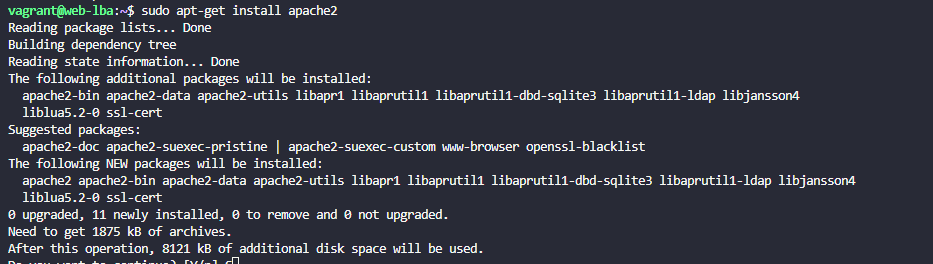

# PR0103: Introducción a Vagrant

Primero nos situamos en el directorio de esta práctica para descargar la imagen de la máquina virtual con el comando: 
``
vagrant box add ubuntu/focal64
``

A continuación, creamos el fichero *Vagrantfile* sin los comentarios pues realizaremos gran parte de la configuración.

Dentro de él añadimos lo siguiente:

- para cambiar el nombre de la máquina virtual
``
config.vm.hostname = "web-lba"
``

- comando para editar las especificaciones
``
 config.vm.provider "virtualbox" do | vb| 
``

- el nombre del equipo
``
vb.name = "Web Server"
``

- asignación de 3GB
``
 vb.memory = 3072 
 ``

- 2 cores virtuales
``
vb.cpus = 2
``

- cerramos la configuración de las especificaciones con end

- adaptador de red privada
``
config.vm.network  "private_network", ip: "172.16.200.10"
``

- adaptador de red publica
``
config.vm.network  "public_network", ip: "10.9.9.10"
``
  

- iniciamos la máquina virtual con *vagrant up*
- nos metemos en la MV con *vagrant ssh*
- instalar el servicio de apache

