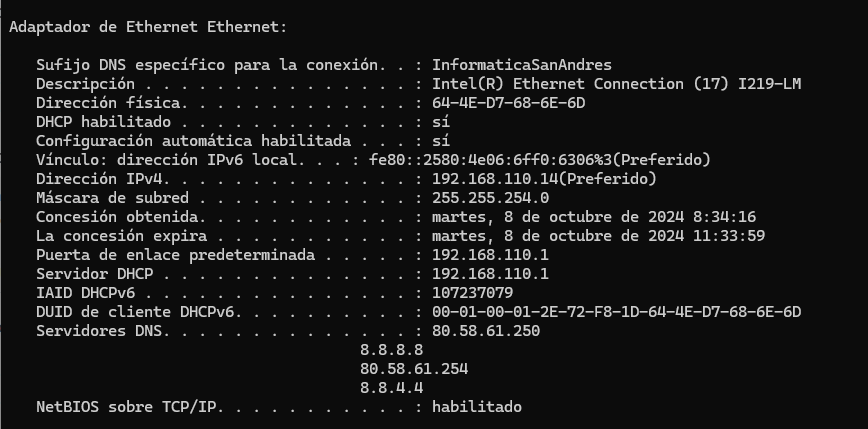

## PR0202: Conexión remota con SSH

1.2

1.2  poner sudo delante porque sino no se tienen permisos para modificarlo
eth1:
dhcp4: true

sudo netplan apply

ip a 
inet y la ip que de 

comprobar la conectividad

maquina fisica --> ping a la ip anterior y que conteste

xrear un usuario en la maquina virtual 

sudo adduser laura
sudo service sshd  status --> para ver si un servicio esta activo

sino esta instalado

sudo apt shh search | grep server

desde power shell
ssh lauara@ip
hay que darle al si y pide contraseña

cd .sshssh-keygen -b y un numero

scp ./id_rsa.pub laura@ip:/home/laura
pide contraseña

si uno se va a la mv y hace su laura y ls /home/laura 

who

ls -la

mkdir .ssh

ls

cat id_rsa.pub >> .ssh/authorized_keys

si sales ahora y vuelves a hacer ssh laura@ip ya no pediria clave

1.4 
