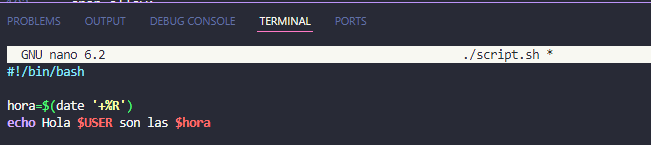
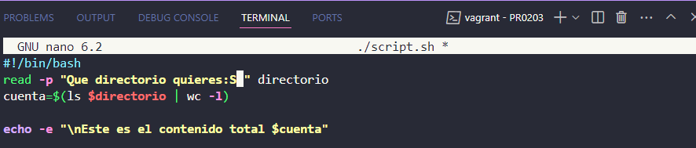
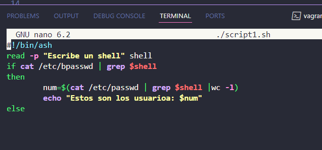
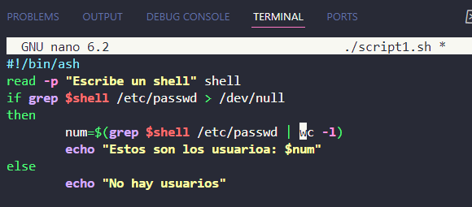

Pregunta a un usuario por un directorio y muestra el nº de archivos y directorios que tiene.

Pregunta al usuario por un nombre y que muestre el shell

read -p "Introducca nombre de usuario: " user
shell=$(cat /etc/passwd | grep $user | cut -d : -f 7)

Pide al usuario un nombre de interprete (p.e. /bin/bash, /bin/s) e indica cuantos usuarios del sistema tienen ese interprete.
Si no hubiera ninguna muestra un mensaje que no los hay.

