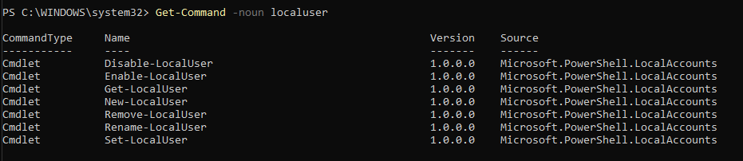
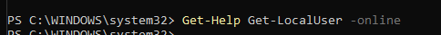

# PR0401: Introducción a Powershell

1. Obtén ejemplos de utilización del comando Get-LocalUser.

2. Obtén un listado de todos los comandos relacionados con la gestión de usuarios locales (es decir, con el nombre LocalUser).

otra forma de hacerlo:

3. Utilizando la línea de comandos, muestra en el navegador la ayuda del comando Get-LocalUser.

4. Averigua para qué sirve el comando Set-Content y explícalo brevemente con tus palabras.

Sirve para reemplazar el contenido de un archivo. 

5. Explica tres formas diferentes de ver o buscar un comando que hayas utilizado anteriormente en tu sesión.

con las flecas y con control + R.

6. Averigua si el comando Get-Process tienen un parámetro llamado ComputerName y en caso afirmativo explica para qué sirve.

Permite ejecutar el comando en equipos remotos.

7. Muestra la ayuda del comando Start-VM en una ventana emergente.

8. Muestra la ayuda del comando Get-Help en el navegador invocándolo desde la línea de comandos.

9.  Muestra las últimas 20 entradas del historial.

10. Elimina las entradas 10, 12 y 14 de tu historial.

