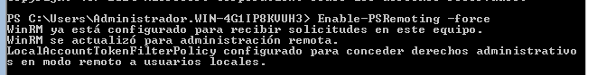
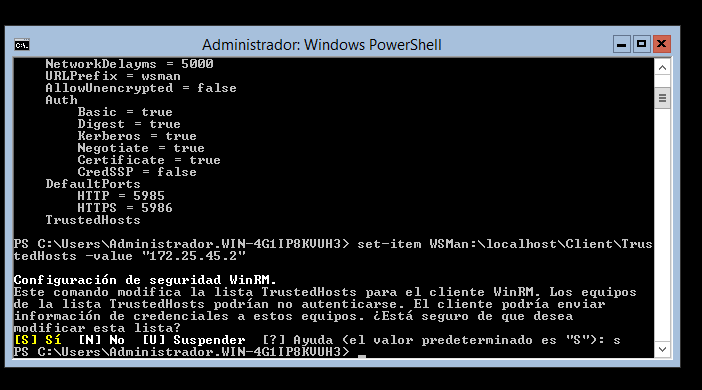

# PR0404: Administración Remota

La siguiente explicación es para la incorporación de un equipo a la una red ya existente, en este caso se trabaja con una máquina virtual con Windows Sever 2012 core pues la iso de 2016 no funcionaba.

Lo primero que realizamos es la comprobacion de los adaptadores de red con el comando ``` get-netIpConfuguration ``` para saber que numero de 'InterfaceIndex' corresponde con el adaptador que queremos modificar.


Continuamos configurando la IP del adaptador red que corresponde en VirtualBox con un adaptador puente, indicandole la direccion IP, mascara y el número del adaptador. El comando para esto es ``` New-NetIPAddress ```, tendria que quedar algo similar a lo siguiente: 


Para comprobar que esta bien comprobamos con el comando ``` Get-NetIpConfuguration ```

Lo siguiente que hacemos es desactivar el Firewall con el comando que aparece en la imagen:


Y tambien hay que configurar que se pueda hacer ping.


Tambien debemos cambiar el nombre del equipo con el comando ```Renove-Computer nombre_equipo -Restart ``` para que se aplique el cambio hay que reiniciar el equipo. y la comprobacion del nombre se hace con ``` $env:computername ```.


Si lo tenemos todo bien configurado deberiamos poder hacer ping entre las tres máquinas sin que ocurran fallos. 


Comprobar que todas las maquinas hacen ping entre ellas.






el winrm hay que indicarle la ip del windows con interfaz grafica


falta terminar de conectarse desde el acceso remoto y crear los usuarios en los dos equipos