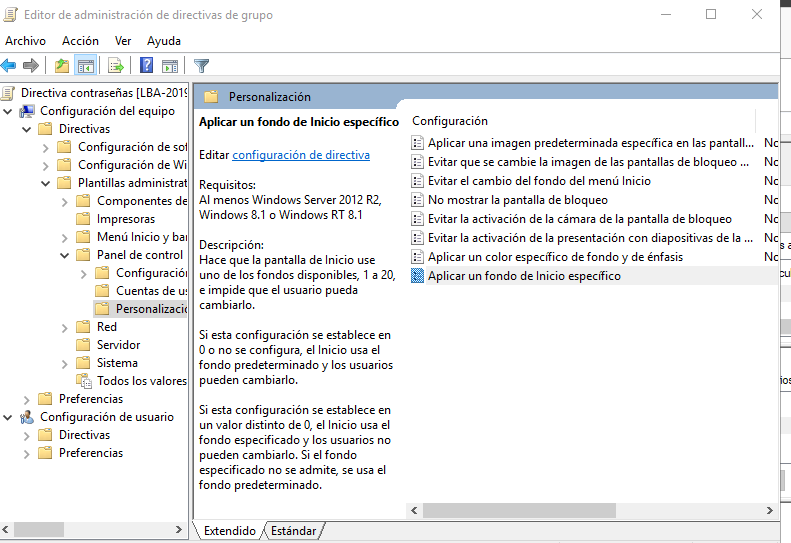

# Aplicación de directivas
d1

d2

d3

Crear la GPO para habilitar el Firewall de Windows en el perfil de dominio:
Abrir el Administrador de Directivas de Grupo (Group Policy Management):

En el servidor de Windows, busca y abre Group Policy Management (Administración de Directivas de Grupo).
Crear una nueva GPO:

En el panel izquierdo de Group Policy Management, haz clic derecho sobre el dominio (o la OU donde deseas aplicar la política) y selecciona "Crear un GPO en este dominio y vincularlo aquí".
Ponle un nombre a la GPO, por ejemplo: "Habilitar Firewall en Perfil de Dominio" y haz clic en Aceptar.
2. Configurar la directiva para habilitar el Firewall:
Editar la GPO:
Haz clic derecho sobre la nueva GPO creada y selecciona Editar.
Navegar a la configuración del Firewall:
Ve a Configuración de equipo -> Directivas -> Configuración de Windows -> Configuración de seguridad -> Windows Defender Firewall -> Perfil del dominio.
Habilitar el Firewall:
Haz doble clic en "Windows Defender Firewall: Estado de la conexión".
Selecciona Habilitado para asegurarte de que el Firewall esté activado en el perfil de dominio.
Haz clic en Aceptar.
3. Excluir el equipo DEV-PC1 de esta GPO:
Para que esta GPO no se aplique a DEV-PC1, puedes usar un Filtro de seguridad. Aquí te explico cómo hacerlo:

Desvincular la GPO de DEV-PC1:

Vuelve a la consola de Group Policy Management.
En el panel derecho, selecciona la GPO "Habilitar Firewall en Perfil de Dominio" y haz clic en "Delegación".
Haz clic en "Avanzado" para abrir las opciones avanzadas de seguridad.
Agregar un filtro de seguridad:

En el panel de Seguridad Avanzada, haz clic en Agregar.
En el cuadro de texto, escribe el nombre de la máquina DEV-PC1 (o selecciona el equipo desde el directorio si es necesario).
Luego, quita el acceso al equipo DEV-PC1 desmarcando las casillas para Aplicar la GPO a este equipo.
Configurar permisos para el equipo DEV-PC1:

Selecciona el equipo DEV-PC1 de la lista.
Haz clic en Quitar o ajusta los permisos para que no se le aplique la GPO (eliminando el permiso para leer la GPO).
d4

d5

d6
